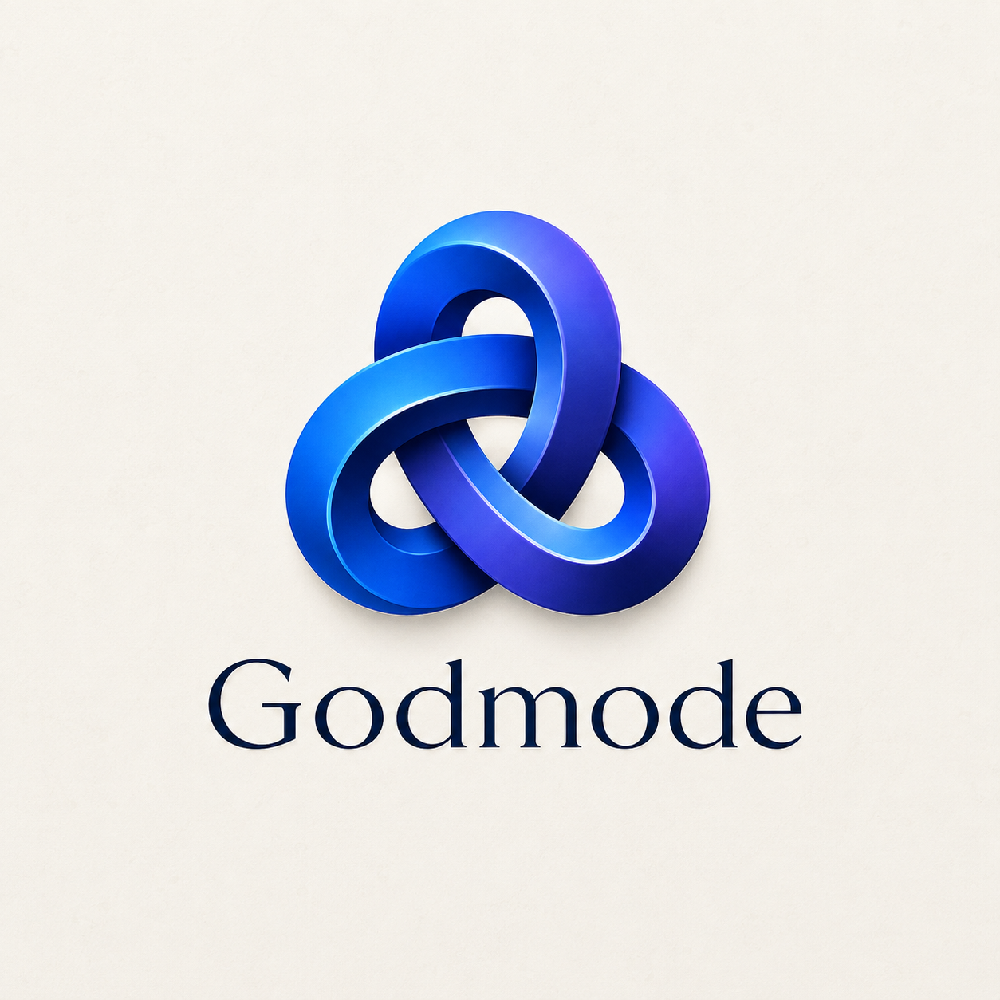

<p align="center">
  
</p>

<h1 align="center">Godmode</h1>

<p align="center">
  Local-first continuity, evidence-led investigation, protected-action previews,
  and on-demand skill forging for Codex and Claude Code.
</p>

Godmode helps a coding agent recover what is true about a project before it acts. It
builds bounded context from inspectable local evidence, records operational continuity
outside tracked project files, detects repeated failed approaches, and makes risky
operations explicit. It does not run protected operations itself.

Godmode is an early preview. Its safety controls are advisory unless the host invokes
the bundled gate adapter before tool execution.

## What it provides

- **Continuity:** reconstructs branch, revision, worktree, obligations, decisions,
  checks, incidents, and recent changes from local evidence.
- **Investigation:** separates observations, hypotheses, contradictions, and unproven
  claims while stopping repeated failed approaches.
- **Action governance:** classifies operations, previews impact and recovery, and issues
  scoped, expiring, single-use local capabilities for protected actions.
- **Skill forging:** proposes a project-specific skill only after a reusable capability
  gap is evidenced, then scaffolds and validates the result.
- **Honest limits:** reports stale or missing evidence and adapter boundaries instead of
  claiming perfect memory or universal enforcement.

## Privacy by construction

Godmode runs only from an explicit command, an invoked skill, or an enabled host
lifecycle hook. It has no telemetry, analytics, update ping, cloud sync, background
daemon, network listener, inference proxy, or idle model use. It does not store raw
prompts, conversations, tool transcripts, source bodies, credentials, or environment
dumps. Repository remote addresses are represented only by one-way hashes.

See [GODMODE_PRIVACY.md](./GODMODE_PRIVACY.md) and
[GODMODE_SECURITY.md](./GODMODE_SECURITY.md) for the complete boundaries.

## Requirements

- Python 3.11 or newer
- Codex with plugin support or Claude Code with plugin marketplace support
- Git is optional; non-Git projects use a salted local project identity

The runtime uses only the Python standard library.

## Install in Claude Code

Add the repository as a marketplace, install Godmode, then reload plugins:

```text
/plugin marketplace add AIimagined/Godmode
/plugin install godmode@aiimagined
/reload-plugins
```

Invoke the main skill with `/godmode:godmode`. Claude Code also loads a bounded local
continuity brief at `SessionStart` after Godmode has been explicitly initialized for
that project. Before initialization, the hook is silent. It performs no network access
and does not read the Claude transcript.

## Quick start

From the repository root:

```powershell
python scripts/godmode.py --project . init
python scripts/godmode.py --project . inspect
python scripts/godmode.py --project . resume
```

Explore the complete command surface:

```powershell
python scripts/godmode.py --help
```

The repository root is both the Codex and Claude Code plugin root. Codex uses
`.codex-plugin/plugin.json`. Claude Code uses `.claude-plugin/plugin.json` and the
co-located `.claude-plugin/marketplace.json`. Godmode does not alter a user's
marketplace or agent configuration automatically.

## Bundled skills

| Skill | Responsibility |
| --- | --- |
| `godmode` | Routes work to the smallest applicable Godmode workflow |
| `godmode-continuity` | Reconstructs and explains bounded project context |
| `godmode-investigation` | Runs evidence-led diagnosis and loop detection |
| `godmode-governance` | Previews and gates protected operations |
| `godmode-skill-forge` | Creates validated local skills for proven reusable gaps |

## Protected actions

Read-only work stays friction-light. A protected or unknown mutation fails closed until
the user authorizes its exact project, category, action fingerprint, and expiry. The
resulting capability is local, password-backed, scoped, expiring, and single use.
Godmode only evaluates and records the decision; it never performs Git, database,
release, deployment, external-write, or destructive operations.

## Development checks

```powershell
python -m compileall scripts hooks tests
python -m unittest discover -s tests -v
python scripts/godmode.py --version
claude plugin validate . --strict
```

The acceptance requirements and their proof surfaces are documented in
[GODMODE_ACCEPTANCE.md](./GODMODE_ACCEPTANCE.md).

## Contributing and security

Read [CONTRIBUTING.md](./CONTRIBUTING.md) before proposing a change. Please follow
[.github/SECURITY.md](./.github/SECURITY.md) for vulnerability reports and never place
secrets or private repository content in a public issue.

## License

Licensed under the [Apache License 2.0](./LICENSE). Attribution and project identity
notices are preserved in [NOTICE](./NOTICE).

Developed by AIimagined.
