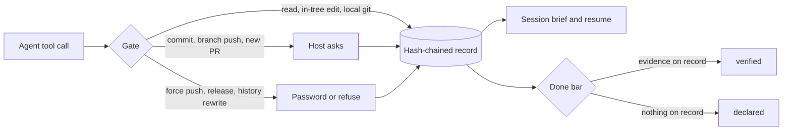

<h1 align="center">
  
</h1>

<h3 align="center">Your coding agent says it is done. Godmode decides whether that is true.</h3>

<p align="center">
  Godmode keeps a hash-chained record of what your agent actually ran, changed and refused,<br>
  and grades every "done" against that record instead of against the agent's word.<br>
  Where the record holds nothing, the work renders <code>declared</code> - said, not shown.
</p>

<p align="center">
  <a href="./LICENSE"></a>
  
  
</p>

<p align="center">
  You have this problem if an agent has ever reported a green suite that never ran,<br>
  or rewritten history because it sounded sure.
</p>

<p align="center">
  
</p>

---

## See it decide

Every block below is real output from this repository, run to write this page.
Nothing here is a mock-up, and every one of these verbs is read-only.

**Before a command that cannot be taken back.** The gate reads what the command
does, then tells you what this project has already refused in the same category:

```console
$ godmode forecast --operation "git push --force origin main"
{
  "category": "git-history-or-remote",
  "impact": [
    "repository history",
    "branches or worktrees",
    "possibly a remote"
  ],
  "note": "classification is from today's rules; precedent is what this project already refused in the same category",
  "operation": "git push --force origin main",
  "precedent": {
    "examples": [
      "git push --force",
      "git push --force origin main",
      "git reset --hard HEAD~3",
      "git status && git push origin main",
      "git commit --amend"
    ],
    "same_category": 38
  },
  "protected": true,
  "second_confirmation_required": true,
  "tier": "R5"
}
```

**When the agent says everything is finished.** The record answers from its own
contents - here, one claim, seven obligations and three rules that nothing has
closed yet. Drop `--brief` and each one is listed with its age and its source:

```console
$ godmode --brief status remaining
work-outstanding | count=11
```

**On this page.** Claim-shaped prose on a public surface is held to the same bar
as a claim an agent records: a sentence carrying a measured number, or a verb
that promises an outcome, has to name its own reproduction on the same line.

```console
$ godmode claim --scan
{
  "claims": 9,
  "definition": "a sentence with a measured number and unit, or a verb that promises an outcome; covered when its line names a reproduction or a claim record carries its text",
  "scanned": [
    "README.md",
    "docs/LISTING.md",
    "docs/CAPABILITY-COVERAGE.md",
    "llms.txt",
    "GODMODE.md"
  ],
  "uncovered": [],
  "verdict": "covered"
}
```

And the same discipline turned on the project itself. The last line is this
repository admitting that records exist whose cited files have been committed
over since they were graded; `godmode freshness` names every one of them:

```console
$ godmode scenarios --brief
all-caught | total=29
$ godmode grid --brief
controls-held | passed=36
$ godmode untrusted --brief
data-only
$ godmode sbom --brief
no-runtime-dependencies | dependency_count=0
$ godmode freshness --brief
stale
```

## What it can do

The gate and the record are the core. Everything below is built on them, and each
row names the command that shows it.

<p align="center">
  
</p>

<p align="center"><sub>How the gate tiers a command: reads, in-tree edits and local git pass; a risky one waits for you; an irreversible one stops.</sub></p>

| You want to | Godmode | Try it |
|---|---|---|
| Know what a change reaches before you make it | reads a local code graph: who calls a symbol, what depends on a file, which tests have to rerun | `godmode atlas affected <symbol>`, `godmode retest` |
| Push without a half-hour surprise | runs CI's cheap gates first and the suite after, on the committed tree in a disposable worktree, and names the tree it validated | `godmode precheck --preflight` |
| Approve one harmful command, once | binds a password approval to the exact command, commit and branch; it is spent on first use | `godmode authorize stage --from-last-refusal` |
| Keep everyday work moving | tiers a command by what it does: reads, in-tree edits and local reversible git run free; a commit, a feature-branch push or a new pull request is an ordinary ask; the password is kept for a force push, a push to the default branch, a release, a history rewrite and a delete outside the tree | `godmode forecast --operation "<command>"` |
| Catch an agent that is looping | reads the transcript for repeating error signatures and overlapping hunks; a declared loop carries a cap and stop conditions | `godmode loop --transcript <path> --episodes` |
| See what a session or a release cost | counts only: spend per session, against declared ceilings, and per release beside gate activity | `godmode trends`, `godmode ceilings`, `godmode roi --releases` |
| Hold work to an approved plan | records the spec, refuses a plan approved by its own author, and checks each edit against the plan | `godmode planmode check` |
| Keep a hypothesis honest | a hypothesis names the check that would refute it, and a falsifier left unrun comes due | `godmode verify --falsifiers --dry-run` |
| Close what the operator asked for | tracks every ask until it is answered, mapped to a task or parked, and lists duplicate or contradicting lessons | `godmode checkpoint --review`, `godmode hygiene` |
| Rewrite history without orphaning evidence | fingerprints every cited commit before a rewrite and finds each one again after | `godmode reanchor --snapshot`, `godmode reanchor --remap` |
| Run several agents in one repository | exclusive leases on a resource and a delegation graph that refuses a cycle | `godmode fleet show` |
| Ship notes that match the release | one fragment per user-visible change, merged into the changelog, with the notes checked against it | `godmode changelog check`, `godmode release-notes check` |
| Be covered before setup | in a project nobody initialized, a destructive command still asks instead of running | `python -m unittest tests.test_hook_uninitialized_fast_exit` |

Twenty-two agent skills front these verbs as named workflows a host discovers on
its own - continuity, investigation, evidence, triage, code graph, CI, budget,
loop warden and the rest ([skills/](./skills/)).

## Install

One plugin package. How much of it can be enforced depends on the host - read
[Host support](#host-support) before relying on a gate anywhere.

**Claude Code**

```text
/plugin marketplace add AIimagined/Godmode
/plugin install godmode@aiimagined
/reload-plugins
```

**Grok**

```console
$ grok plugin marketplace add AIimagined/Godmode
$ grok plugin install godmode --trust
```

**Codex, Antigravity, OpenCode, Copilot, Kiro.** Skills and the CLI install with
the package; the hooks need one wiring step per project. Preview it first - the
preview uses the same code path an apply would, and stops rather than half-apply
when anything is in the way:

```console
$ godmode hooks wire --all --dry-run
{
  "changed": [],
  "lines": [
    "[CREATE] codex: .codex\\hooks.json",
    "[CREATE] antigravity: .agents\\hooks.json",
    "[CREATE] opencode: .opencode\\plugins\\godmode.js",
    "[CONFLICT] copilot: .github\\hooks\\godmode.json + .github\\copilot-instructions.md",
    "[UPDATE] kiro: .kiro\\hooks.json"
  ],
  "summary": "blocked; no changes made"
}
```

That `CONFLICT` is this repository's own checked-in Copilot artifact, and one
conflicting host is enough to stop the whole pass: a differing file is reported
rather than overwritten, until `--force` says otherwise. In a project with no
host config of its own, every line reads `[CREATE]`. Drop `--dry-run` to apply,
or pass `--host <name>` to wire one. On Codex the operator then Trusts each
listed command inside `codex`; that step is Codex's own and cannot be automated.
Per-host wiring detail lives in [docs/hosts/](docs/hosts/).

**macOS.** Every hook and the `godmode` shim probe `python3`, `python`, then `py`
on the hook's PATH, then the usual off-PATH homes (Homebrew, MacPorts, pyenv
shims, the python.org framework, `~/.local/bin`, and stock `/usr/bin/python3`
last, since it is a stub until the developer tools are installed). A host
launched from the Dock carries a shorter PATH than your terminal, which is why
that list exists. `GODMODE_PYTHON=<path>` overrides the probe, and
`godmode doctor --host claude` reports which interpreter answered.

Inside a session, `godmode ...` resolves through the host's own shell tool.
Outside one, call the installed copy directly:

```console
$ python ~/.claude/plugins/cache/aiimagined/godmode/<version>/scripts/godmode.py init
```

**PATH.** A plugin install does not put a bare `godmode` on PATH. The shim
lives at `<plugin root>/bin/godmode.cmd` on Windows or `<plugin root>/bin/godmode`
on macOS/Linux - call it by that path, or add its `bin` directory to PATH
yourself for a bare `godmode` command.

## First five minutes

Start with nothing blocked. In observe mode every gate that would deny or ask
records what it *would* have done and lets the command through:

```console
$ godmode init
$ echo '{"gate_mode": "observe"}' > .godmode-authorization-policy.json
```

Work a normal week, then read what it would have caught:

```console
$ godmode roi --digest
```

Each line is a would-have-denied or would-have-asked count by category, with the
sessions it happened in. None of it merges with real enforcement numbers, because
none of these events were blocked. Delete the policy file - or just its
`gate_mode` key - to enforce for real, and pick a starting posture:

```console
$ godmode init --profile novice     # asks before an ordinary file edit or a new branch
$ godmode init --profile standard   # today's defaults; writes nothing
$ godmode init --profile strict     # also asks before a release-affecting write
```

The posture is a ratchet that only tightens: no profile removes an approval
category an operator already set on record. Turn observe mode on from your own
editor or terminal rather than from inside a governed session - once a session is
governed, that policy file is itself a protected surface, so the gate cannot be
told to stop watching by the thing it watches.

From there, three verbs carry most days:

```console
$ godmode resume              # what is true now, rebuilt from recorded evidence
$ godmode status remaining    # what a "complete" still owes
$ godmode doctor              # archive health, calibration, dormant machinery
```

## How it works


```mermaid
flowchart LR
    A[Agent tool call] --> G{Gate}
    G -- "read, in-tree edit, local git" --> R[(Hash-chained record)]
    G -- "commit, branch push, new PR" --> H[Host asks]
    G -- "force push, release, history rewrite" --> Q[Password or refuse]
    H --> R
    Q --> R
    R --> B[Session brief and resume]
    R --> D{Done bar}
    D -- "evidence on record" --> V[verified]
    D -- "nothing on record" --> X[declared]
```

**The record.** A hash-chained archive lives beside the repository's git metadata
rather than in the working tree, so it survives whatever a session does to files.
It holds relative paths, statuses, hashes, keywords and digests - never prompts,
conversations or source bodies ([GODMODE_PRIVACY.md](GODMODE_PRIVACY.md)). At
session start a bounded brief is rebuilt from it: identity, last checkpoint, next
actions, standing laws, open obligations. After a compaction, a branch switch or a
week away, `godmode resume` reconstructs the same picture from evidence instead of
from prose memory.

**The bar.** A claim is graded, not accepted. `verified` is reserved for a
verified state with cited evidence; a `confirmed` verdict needs a witness and an
independent checker that recomputes from the witness alone. At the end of a
session the done bar blocks one "everything is complete" while the record still
holds this session's operator asks, pending plan steps, criteria no claim cites,
or a temporary change nobody restored - and lists each one with its closing
command. Thirteen integrity monitors read the diff since the last green for the
shapes that make a suite go green dishonestly: an assertion removed, a skip
added, a literal moved to match new output, a test weakened in the same change as
the code it checks (`godmode integrity --base HEAD`).

**Approvals.** A command the gate will not pass on its own is approved by the
password holder, for that command alone: `godmode authorize stage
--from-last-refusal` stages exactly what was refused. The approval is tied to the
repository, the worktree, the commit and the branch, and a new commit voids it.
A staged approval is valid for up to twelve hours and is spent on its first use (`python -m unittest tests.test_staging_lifetime`).
An approval nobody answers is named after thirty minutes, and the agent is told to carry on with files the pending call does not touch (`python -m unittest tests.test_stall_watch`).

**What it learns.** Corrections and standing instructions become candidate
lessons - keywords and a digest, never the sentence. A candidate that recurs can
be promoted into the project's own `GODMODE-CODE-OF-LAW.md`, and a promotion
needs a second actor: `godmode lessons approve` is refused when the approver is
the promoter, or when the re-run hash repeats the promotion's own. A compiled law
steers the session through the brief; it hard-refuses a matching record write
only when its lesson carries an enforce predicate.

**What it forgets.** `godmode forget` expires old episodes into a cold segment
that stays on the same chain - actions and refusals after thirty days,
attestations after ninety - while anything a live claim, checkpoint, law guard or
pin still cites never expires, and history can still reach a cold record by
sequence. `godmode forget --dry-run` reports a pass without recording one.

**Locking a skill.** Project skills change freely, and a change made with nobody
watching is reported once and listed by `godmode status`; list a skill in
`.godmode-boundaries.json` (`"ui": {"declared": ["skills/<name>/**"]}`) and every
writer - an edit, `skill forge`, `retire`, `restore` - is refused in every session
unless you make the change yourself, stage it with the password as the refusal
shows (`authorize stage --operation "edit file <path>"` for one edit, `"retire skill <name>"`,
`"restore skill <name>"` or `"forge skill <name>"` for a skill command), or run the skill command
`--as-operator`.

Every verb, its purpose, and a command that verifies it:
[docs/COMMAND-REFERENCE.md](docs/COMMAND-REFERENCE.md), generated from the CLI's
own parser and guarded against drift. Two-minute walk-through:
[docs/DEMO.md](docs/DEMO.md).

## What it does not do

- **Most hosts are not proven.** Of eleven declared hosts, two carry a live,
  chronicled interception proof: Claude Code and Grok. Everything else is a
  structural claim about what ships, and `godmode capabilities` says so rather
  than reporting `HARD` - the per-feature grid is in
  [docs/HOST-FEATURE-REACH.md](docs/HOST-FEATURE-REACH.md).
- **The gate costs time.** `python benchmarks/gate_latency.py --notes-line` reads the committed baseline from the development machine: p95 162 ms for a fast-allowed read-only command, 624 ms for one that escalates to the full classifier, twenty-one samples each. Re-measure on your own machine with `python benchmarks/gate_latency.py --check`.
- **Static reading has a floor.** A diff cannot show that a test still means what
  it meant. A renamed test that keeps its assertion method and loses its meaning,
  or a weakening split across two change sets, passes the monitors
  ([CHANGELOG.md](CHANGELOG.md) states the full non-coverage per detector).
- **Nothing here touches the network**, so a `url:` citation is reported
  unverifiable rather than fresh, and `godmode netgate` proves zero outbound
  connections for five CLI surfaces only, not for hook subprocesses or for a
  check command you supply yourself ([THREAT-MODEL.md](THREAT-MODEL.md)).
- **Judgment needs history.** Enforcement works from the first prompt, but
  calibration reports only once resolved scored claims exist, and laws distill
  only from recorded corrections. An empty archive is correct silence.
- **Developed and tested on Windows.** The Windows kill path for an overrun run is
  exercised for real; the POSIX path is pinned by a mocked unit test, not live-probed.

## Host support

Enforcement tier is computed from what the running environment proves, never from
the host's name. `godmode capabilities` reports `tool_call_interception` as one of
`HARD` (a live, chronicled proof: a real pre-tool hook denied a marker operation
and recorded the denial), `DEGRADED` (a proof since superseded, expired or
drifted), `PARTIAL` (wired, not freshly proven), `SOFT` (skills and CLI only), or
`UNAVAILABLE`.

| Host | What ships | Where it stands |
|---|---|---|
| **Claude Code** | Plugin and hooks (`SessionStart`, `PreToolUse`, `UserPromptSubmit`, `Stop`, and the rest) | Live-proven. Real tool calls in a session are intercepted and recorded; a protected command writes a refusal record, a prompt writes a request record. |
| **Grok** | Same package, same hooks convention | Live-proven on Windows across four field sessions, the latest pinning the command shape its PowerShell path needs. Grok has no `ask`, so a would-ask folds to deny. |
| **Codex** | Same package plus a project-level fallback (`godmode hooks wire`) | Hooks fired live once; the operator Trusts each command in `codex` first. Codex ignores plugin-bundled hook manifests, which is why the fallback exists. |
| **Antigravity** | Native skill discovery plus a hook artifact | Skills and CLI live-proven by an agent that cloned this repo and ran the suites through its own tools. The hook side is transcribed from published docs, so the gate reads `SOFT`. |
| **OpenCode** | Instruction-file adapter plus a Bun/Node plugin shim | Every `bash`/`write`/`edit`/`patch` call runs through the real gate and a deny throws before the tool runs; declared `SOFT` until a live block is chronicled. |
| **Copilot, Kiro** | Generated hook manifests, wired by `godmode hooks wire` | Replicated from each host's own hook shape and pinned by a checked-in test; awaiting live confirmation. |
| **Cursor, Gemini CLI** | Instruction-file adapters plus shipped hook manifests | Structural only. Neither is installed on the development machine, so neither manifest is live-probed; an ordinary session reads `UNAVAILABLE` unless it declares its host. |
| **CI (GitHub Action)** | `action.yml`, integrity and changelog gates | Runs the same CLI; no hook boundary involved. In the dispatch workflow, a generated job per host manifest installs the plugin that host's way and fires one hook. |

The CLI verbs need no host at all: they run wherever the model can run a shell.

## The numbers

| What | Reproduce it |
|---|---|
| 29 staged failure and attack shapes, all caught | `godmode scenarios --brief` |
| 36 attacks on the controls, all held | `godmode grid --brief` |
| 105 capability entries reconciled, no dead pointers either way | `godmode capabilities --reconcile` |
| 438 recorded commands replayed against today's classifier | `python -m unittest tests.test_gate_corpus` |
| Thirteen integrity monitors over the diff since the last green | `godmode integrity --base HEAD`; the table is `MONITORS` in `scripts/godmode_runtime/godmode_integrity.py` |
| Repository text clean of instruction-shaped strings | `godmode untrusted --brief` |
| Zero runtime dependencies, standard library only | `godmode sbom` |
| 22 agent skills hosts discover natively | [skills/](./skills/) |

Run `python -m unittest discover -s tests` for today's pass count rather than
trust a number printed here that could go stale on the next commit.

## Learn more

| Document | Covers |
|---|---|
| [docs/DEMO.md](docs/DEMO.md) | Two-minute terminal walk-through, every command pinned against the real CLI |
| [docs/COMMAND-REFERENCE.md](docs/COMMAND-REFERENCE.md) | Every verb, its purpose, and a command that verifies it - generated from the parser |
| [docs/LADDER.md](docs/LADDER.md) | Four tiers of onboarding, one session each; `godmode guide --tier N` prints one |
| [docs/CAPABILITY-COVERAGE.md](docs/CAPABILITY-COVERAGE.md) | What is covered, partial, or not-claimed, and at what grade |
| [docs/HOST-FEATURE-REACH.md](docs/HOST-FEATURE-REACH.md) | Which feature can fire on which host, and the stated reason for every gap |
| [docs/COMPACTION-AND-LEDGER.md](docs/COMPACTION-AND-LEDGER.md) | What survives a compaction, the context tripwire, perimeter checks |
| [docs/hosts/](docs/hosts/) | Per-host pages: wired events, known issues, the proof recipe that earns HARD |
| [docs/releases/](docs/releases/) | Release notes; every number in them carries its own basis |
| [GODMODE.md](GODMODE.md) | Product guarantees, gates, and the start sequence |
| [GODMODE_PRIVACY.md](GODMODE_PRIVACY.md) | What is stored, where, and what never leaves |
| [THREAT-MODEL.md](THREAT-MODEL.md) | Threats, controls, and stated non-goals |
| [skills/](./skills/) | The agent skills hosts discover natively, with routing evals pinning them |
| [CHANGELOG.md](CHANGELOG.md) | Released changes, each with the limits of what it checks |

## License

Apache License 2.0 ([LICENSE](./LICENSE)); attribution and project identity
notices in [NOTICE](./NOTICE). Developed by AIimagined.
